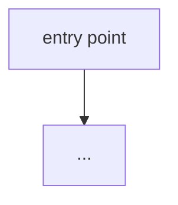

Onboard me to this codebase. I'm a new developer. Be concrete and cite real files.

## Signals (language-agnostic)
- README: !`cat README* 2>/dev/null | head -60 || echo "no README"`
- File-type breakdown: !`python3 -c "import subprocess,collections; files=subprocess.run(['git','ls-files'],capture_output=True,text=True).stdout.split(); exts=collections.Counter(f.rsplit('.',1)[-1] if '.' in f else '(none)' for f in files); [print(f'{v:>6}  .{k}') for k,v in exts.most_common(10)]"`
- Top-level layout: !`python3 -c "import subprocess; files=subprocess.run(['git','ls-files'],capture_output=True,text=True).stdout.split(); dirs=sorted(set(f.split('/')[0]+'/' for f in files if '/' in f)); [print(d) for d in dirs[:25]]"`
- Manifests / entry points: !`python3 -c "import os; [print(f) for f in ['package.json','pyproject.toml','Cargo.toml','go.mod','pom.xml','build.gradle','Makefile'] if os.path.exists(f)]"`
- Package scripts (if node): !`python3 -c "import json,os; d=json.load(open('package.json')); [print(k+':',v) for k,v in d.get('scripts',{}).items()]" 2>/dev/null || echo "n/a"`
- Route/handler surface: !`git grep -nIE "(router\.|app\.(get|post|put|delete)|@(app|router)\.(route|get|post)|http\.HandleFunc|@RequestMapping)" 2>/dev/null | head -20 || echo "no obvious web routes"`
- Data models: !`python3 -c "import subprocess,re; files=subprocess.run(['git','ls-files'],capture_output=True,text=True).stdout.split(); [print(f) for f in files if re.search(r'(schema|model|entity|migration)',f,re.I)][:12]"`
- Test count: !`python3 -c "import subprocess,re; files=subprocess.run(['git','ls-files'],capture_output=True,text=True).stdout.split(); print(sum(1 for f in files if re.search(r'(test|spec)',f,re.I)))"`

## Output a structured guide

### What this project does (2 sentences)

### Architecture at a glance
Produce a **Mermaid diagram** of the real components and how they connect (renders on GitHub):

### The 5 files to read first
List real paths, each with one line on why it matters.

### The 3 things never to touch without deep understanding
Auth, migrations, shared core utils — whatever the danger zones actually are here.

### How to run, test, and build
Exact commands, inferred from the manifests above.

### The most surprising thing about this codebase
One honest, specific observation a newcomer would trip on.
