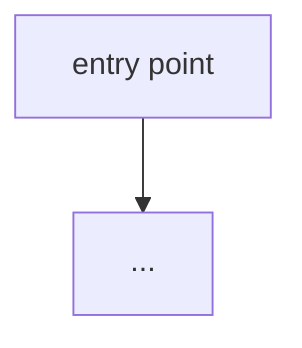

Onboard me to this codebase. I'm a new developer. Be concrete and cite real files.

## Signals (language-agnostic)
- README: !`cat README* 2>/dev/null | head -60 || echo "no README"`
- File-type breakdown: !`git ls-files 2>/dev/null | sed 's/.*\.//' | sort | uniq -c | sort -rn | head -10`
- Top-level layout: !`git ls-files 2>/dev/null | awk -F/ 'NF>1{print $1"/"}' | sort -u | head -25`
- Manifests / entry points: !`ls package.json pyproject.toml Cargo.toml go.mod pom.xml build.gradle Makefile 2>/dev/null`
- Package scripts (if node): !`test -f package.json && grep -A15 '"scripts"' package.json | head -17 || echo "n/a"`
- Route/handler surface: !`git grep -nIE "(router\.|app\.(get|post|put|delete)|@(app|router)\.(route|get|post)|http\.HandleFunc|@RequestMapping)" 2>/dev/null | head -20 || echo "no obvious web routes"`
- Data models: !`git ls-files 2>/dev/null | grep -iE '(schema|model|entity|migration)' | head -12`
- Test count: !`git ls-files 2>/dev/null | grep -iE '(test|spec)' | wc -l | tr -d ' '`

## Output a structured guide

### What this project does (2 sentences)

### Architecture at a glance
Produce a **Mermaid diagram** of the real components and how they connect (renders on GitHub):

### The 5 files to read first
List real paths, each with one line on why it matters.

### The 3 things never to touch without deep understanding
Auth, migrations, shared core utils — whatever the danger zones actually are here.

### How to run, test, and build
Exact commands, inferred from the manifests above.

### The most surprising thing about this codebase
One honest, specific observation a newcomer would trip on.
