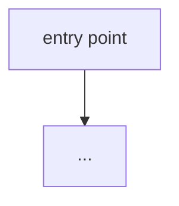

# onboard-me

## Overview

5-minute codebase onboarding. Reads real signals from the repo, produces a structured guide with a Mermaid architecture diagram, and highlights what not to touch without deep understanding. Everything cites real files.

## When to Use

- "I'm new to this codebase, orient me"
- Starting work on an unfamiliar repo
- Onboarding a teammate

## Core Pattern

### Gather signals

```bash
cat README* 2>/dev/null | head -60 || echo "no README"

# File-type breakdown
find . -type f ! -path '*/.git/*' ! -path '*/node_modules/*' \
  | sed 's/.*\.//' | sort | uniq -c | sort -rn | head -15

# Top-level layout
ls -1 | head -20

# Entry points / manifests
ls package.json go.mod Cargo.toml pyproject.toml pom.xml build.gradle 2>/dev/null

# Package scripts (Node)
cat package.json 2>/dev/null | python3 -c "import json,sys; d=json.load(sys.stdin); [print(k,':',v) for k,v in d.get('scripts',{}).items()]" 2>/dev/null | head -10

# Route / handler surface
git grep -nIE "(router\.|app\.(get|post|put|delete)|@(app|router)\.(route|get|post)|http\.HandleFunc|@RequestMapping)" 2>/dev/null | head -20

# Test count
find . -type f \( -name "*.test.*" -o -name "*.spec.*" -o -name "test_*.py" \) \
  ! -path '*/node_modules/*' | wc -l
```

### Produce the structured guide

**What this project does** (2 sentences)

**Architecture at a glance** — Mermaid diagram of real components and connections:


**The 5 files to read first** — real paths, one line each on why it matters.

**The 3 things never to touch without deep understanding** — auth, migrations, shared core utils — whatever the danger zones actually are here.

**How to run, test, and build** — exact commands, inferred from manifests above.

**The most surprising thing about this codebase** — one honest, specific observation a newcomer would trip on.

## Common Mistakes

- **Generic architecture diagrams** — use the actual module names found in the repo, not placeholder boxes.
- **Citing files that don't exist** — every file path must be real and verified.
- **Skipping the "most surprising thing"** — this is often the highest-value part for a newcomer.
